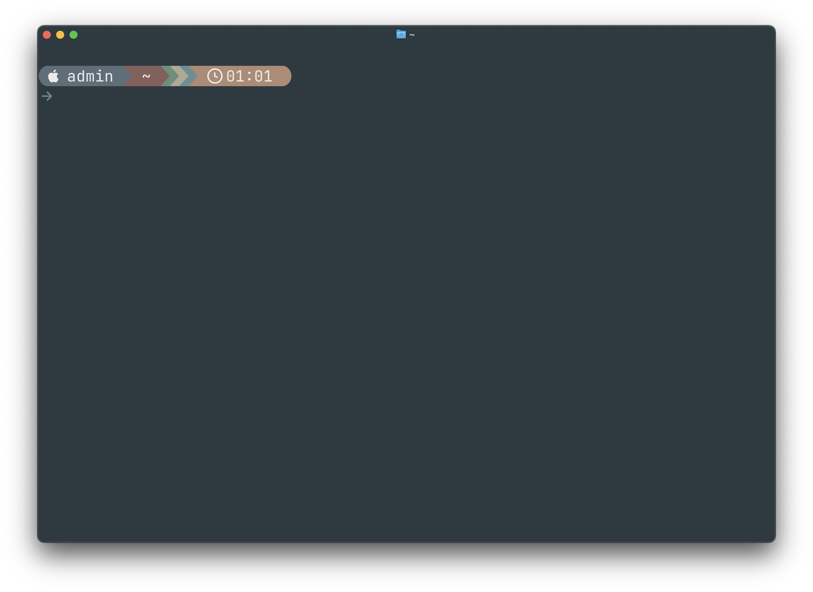

# gruvbox-rainbow-to-ryuuko
This is a *very* slight configuration change to the [gruvbox-rainbow theme](https://starship.rs/presets/gruvbox-rainbow) for [starship shell prompt](https://starship.rs) to match the Ryuuko theme.

Follow the instructions with the links above to install starship and the gruvbox-rainbow preset, then overwrite the file in "~/.config/starship.toml" with the contents of this file and enjoy.

